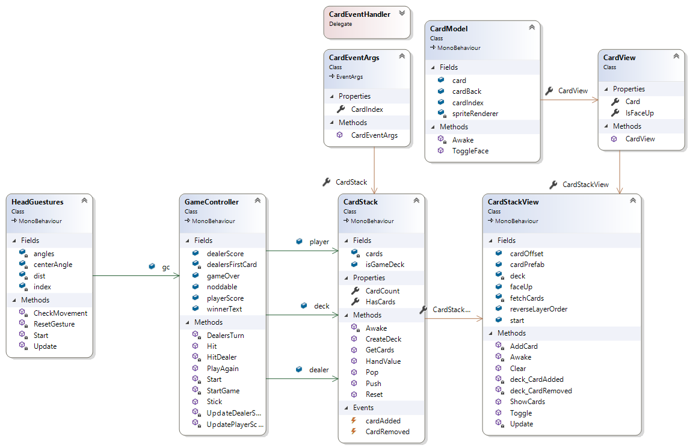

# Gesture-Based-UI-Project
This project is a 4th year assignment for the module Gesture Based UI Development.

At [GMIT](www.gmit.ie) Galway

Author: Kevin Gleeson
## Link to YouTube demo [HERE](https://www.youtube.com/watch?v=qdQGHUeOEsk)

## Running the application

Please follow the steps below to run the application on your android device.

### You will need an android mobile device along with a VR headset in order to use this application.

1. Clone this repository then connect you android device to your pc.

2. Once cloned you will find an APK file named test.apk.

3. Connect your android device to your pc via usb.

4. Copy the file over to your devices root directory.

5. Disconnect your android device from your pc.

6. Locate the apk file on your mobile device click on it and install when prompted.

7. You may be warned about the security of the unknown apk file you will have to allow it to run just follow the instruction the device gives you to allow it to run. It may vary between devices.

8. Start the application on your device

9. Put your mobile into a VR headset and enjoy!!!!!


## Overview
For this module we were given an open ended project that integrates gesture based user interaction with an application.
Using voice commands hand or head gestures to control an object via a software framework.
The choice of programming language and hardware was up to us to choose along with the type to gesture control to implement.

I have chosen to develop a blackjack game in VR using head gestures, unity, google cardboard and my android phone.
The player controls the game via head movements nodding yes or no to choose between the options available to the user.
The two options are Stick (nod no) or twist (nod yes).

Once the game has been completed (win or lose) a message is displayed to the user along with an option to play again.

The option to play again is in the form of a button in the user’s view that can be activated via gaze input.
When the user points the reticule at the button for more than 1 second it will create a click event to restart the game.

However before I came to decide on developing this system there were other ideas that were considered.


### Initial ideas.

The first idea I had was to develop a 3D game that controls a game object via a mobile phone accelerometer. 

This user would control the object via hand gestures of:
Tilt Left: move left.
Tilt Right: move right.
Tilt Up: Move forward.
Tilt down: Move backwards.

The player’s game object would have to collect certain shapes to gain a positive score.
There would also be certain shapes that would have a negative impact on the players score.

The objects that the player would collect and avoid would be dropped into the playing area for interaction.
In researching this proposal I had my phone displaying the accelerometer and gyroscope data along with moving a basic game object in a 3d environment.

However there was an issue with the data being processed by my phone specific to my model and an alternative proposal was needed for this project.
Here is an article on unity forums explaining the problem [Link Here](https://answers.unity.com/questions/1273323/gyroscope-samsung-s7-doesnt-work-properly.html).

### New Plan
After researching what my model of phone was capable of for gesture based development I found Google Cardboard was a possibility.
I had a talk with my lecturer and we discussed VR and head gestures controlling a card game.
From this conversation I had the idea of creating a blackjack game that would be controlled by head gestures.

In the sections below I will discuss how I went about developing the game along with implementing the head gesture recognition for the system.

### Purpose of the application
The purpose of this application is to allow a user to control a card game while using only head gestures.


The card game will be presented to the user via an app on their mobile phone.
This app is a virtual reality environment using Google VR.
With the phone attached to a Google cardboard or similar device the users head positon can be tracked.
Tracking the users head is achieved by getting the angle of tilt relative to the phone position (More about this below).
With this data we can then capture head gestures and map them to actions within the game.


### Gestures identified as appropriate for this application
The gestures chosen for this application are yes and no head movements.

Yes moving head up and down and No by moving head left and right.

These head movements will map to the actions of stick or twist within the game environment.

The head gesture of yes triggering the twist function and giving the player a new card.

The head gesture of no triggering the stick function and activating the dealers turn function.

When the game of black jack has finished the user is presented with a message if they have won or not and the option to play again or exit the application. 

The yes head gesture will play again and the no gesture will exit the application.


### Hardware used in creating the application
The application is compiled and built to an android device with unity.

A VR headset is used to view the game when the application is run on the device.


### Development

When first developing the blackjack portion of the application buttons were used for click events of stick, twist and play again.

These buttons triggering the stick, twist and play again will eventually be removed once the game functions have been verified as working.

These functions will then be mapped to yes and no head gestures.
### Black Jack game development

#### Sprites:
A PDF file containing images of a deck of cards was used to represent the playing cards in the game environment.
The sprite editor was then used to cut each card from the pdf as individual sprites.
This gave us a complete deck of cards to use for the development of the game.
Later values were attached to each card image which will be discussed in the below section "Adding values to the cards"

### Game controller
The game controller script in the application handles all of the game logic and each of the player, dealer and deck prefabs.
The three card stacks of player, dealer and deck are added within the unity editor.
These are made publicly available from the Game controller script.
```C#
 // Three card stacks for the player, dealer and the deck
    public CardStack player;
    public CardStack dealer;
    public CardStack deck;
```

A Boolean variable of noddable is used to control if the player is allowed to use head gestures.
If the player has chosen to stick or there score is greater than 21 they should not be able to twist a card.
```C#
// Boolean to control the gesture input
    public bool noddable = true;
```

A Boolean variable of game over is used to check if the game has ended to allow the player to choose to play again or quit the application.

```C#    
    // Boolean to control head gesture input on game over
    public bool gameOver = false;
 ```
 
 #### Update player/dealer score functions
 
 When the player chooses to twist the score UI gets updated based on the total value of the cards they have in their hand.
 
 The UpdatePlayerScore/UpdateDealerScore functions:
 ```C#
 void UpdatePlayerScore()
    {
        playerScore.text = "Player Score: "+player.HandValue().ToString();
    }
    void UpdateDealerScore()
    {
        dealerScore.text = "Dealer Score: "+dealer.HandValue().ToString();
    }
 ```
 These functions get called in the player and dealer turn functions described below in the player and dealer turn sections.
 
#### UI messages

Three UI text variables are used to display to the user the:
- player score
- dealer score
- Winning/loosing text message.
```C#
 // Displays the message to the user after the game has ended
    public Text winnerText;
    public Text playerScore;
    public Text dealerScore;
```


#### Shuffling the deck
To shuffle the deck of cards the Fisher Yates shuffle algorithm is used.

The algorithm works by starting at the beginning of an array in our case it will be the array holding the deck of cards.

A random number is generated from 0 - 51.

Suppose 34 is generated the card at index 34 is swapped with the card at index 0.

The algorithm then moves to index 1.

A random number is then generated between 0 - 51.

If 22 is randomly chosen the card at index 22 is swapped with the card at index 1.

This repeats until we have moved to the last element in the array at 51.

```C#
 // Creating the shuffled deck of cards
    public void CreateDeck()
    {
        // Clear the cards array
        cards.Clear();
     
        //Add the 1 - 52 to the cards array
        for (int i = 0; i < 52; i++)
        {
            cards.Add(i);
        }

        int n = cards.Count;
        // Fisher yates shuffle
        while (n > 1)
        {
            //decrement the counter by one
            n--;
            // Pick a random number between the current size of the array.
            int k = Random.Range(0, n+1);
            //store random value 
            int temp = cards[k];
            // assign to 52nd slot on first pass the random value to n. 
            //(n will decrease by one after each recursive call)  
            cards[k] = cards[n];
            // Finally add the random index to the cards array
            cards[n] = temp;
        }
    }
```


#### Adding Values to the cards
The card stack script controls the values of each card.
The full list of cards are held in an array.
The cards are ordered from (ace, 2, 3 ... , King).

Therefore a mod 13 operator can be used to get each card within the array.
The first card from each suit is ignored as they are aces.

We will deal with giving the value to an ace further down this function.

First off the cards between 2 and 9 are given there face values.

Then the Jack, Queen and King are given a value of ten.


```C#
// Set the value of the cards
    public int HandValue()
    {
        // Keep track of the cards
        int total = 0;
        int aces = 0;
        //loop through the card array.
        foreach(int card in GetCards())
        {
            // All card are stored from ace to king in each suit
            // % 13 will split them up into indvidual values
            int cardRank = card % 13;
            // 0 = ace 
            // Get values from 2 - 9 excluding ace, king, queen  and jack
            if(cardRank <= 9 && cardRank > 0)
            {
                cardRank += 1;
                // total the value
                // This is use to calculate the player and dealer score
                total = total + cardRank;
            }
            // set the values for king, queen , jack (all = 10).
            else if(cardRank >9 && cardRank <= 12)
            {
                cardRank = 10;
                // Add to the total score
                total = total + cardRank;
            }
            else
            {
                // Count the aces
                aces++;
            }

            
        }
```

#### Handling the ace card value
The aces have to be accounted for as a value of 1 if the total score of the player or dealer hand is less than 21.

IF the player or dealer hand is greater than 21 the ace gets a value of one.

The total score is recorder by the total variable.
```C#
        // for the different possible values the ace can have either a one or eleven.
        for (int i = 0; i < aces; i++)
        {
            // check if the current score is less than or equal to 21
            if (total+11 <= 21)
            {
                // Ace == 11 if above condition is true
                total = total + 11;
            }
            else
            {
                // Ace is worth one if false.
                total = total + 1;
            }
        }

        // The final score
        return total;
    }
```
#### Players turn

 At the start of each game the cards are dealt to the player and dealer.
 The StartGame function is used to deal two cards to the player and dealer with push and pop methods use to take a card from the main deck and place them in the dealer and player deck array.
 
 ```C#
 void StartGame()
    {
        
        // Deal two card each to the player and dealer form the shuffled deck
        for (int i = 0; i < 2; i++)
        {
            player.Push(deck.Pop());
            UpdatePlayerScore();
            HitDealer();
        }
    }
 ```
 The push method:
 ```C#
 // to put a new card to the player or dealer hand
    public void  Push(int card)
    {
        cards.Add(card);
        if (cardAdded != null)
        {
            cardAdded(this, new CardEventArgs(card));
        }
    }
 ```
 
 The pop method:
 ```C#
 // To remove a card from the main deck
    public int Pop()
    {
        int temp = cards[0];
        // Remove first card from the stack
        cards.RemoveAt(0);

        if (CardRemoved != null)
        {
            CardRemoved(this, new CardEventArgs(temp));
        }
        return temp;
    }
 ```
 The player has control of the game first with the option of sticking or twisting.
 IF the player chooses to twist the player score is updated and checked if they have gone above 21.
 If it has a score greater than 21 the dealers turn method is called and the players head gestures are turned off.

#### Twist:

 ```C#
 public void Hit()
    {
        
        // Push a card from the stack to the players cards
        // Remove the card from the deck stack
        player.Push(deck.Pop());
        UpdatePlayerScore();

        // Check if the player has gone bust
        if (player.HandValue() > 21)
        {
           
            // Turn off the head gesture 
            noddable = false;
           // Start the dealers turn to show their cards
            StartCoroutine(DealersTurn());
        }
    }
 ```
#### Stick:
IF the player chooses to stick the noddable variable is set to false to prevent the player from twisting for the remainder of the game.
The dealers turn is then called as a corutine to allow for a delay of one second between cards being shown to the screen.

```C#
public void Stick()
    {
        // If the player sticks (no gesture)
        // Turn off head recognition
        noddable = false;
        // Start the dealers turn
        StartCoroutine(DealersTurn());
    }
```
#### Dealers turn
When it is the dealers turn the first card is turned over and the dealer begins to twist.
Each time the dealer twists for a new card the dealers score is updated and checked against the player score.
The dealer also keeps twisting while there hand value is less than 17.
 ```C#
 IEnumerator DealersTurn()
    {
        // Turn off head gestures for the dealers turn
        noddable = false;
       
        CardStackView view = dealer.GetComponent<CardStackView>();
        // Show the dealers first card.
        view.Toggle(dealersFirstCard, true);
        view.ShowCards();
        UpdateDealerScore();
        // Delay showing the dealers card every one second for a new card
        yield return new WaitForSeconds(1f);
        // Keep going while the dealers hand is worth at least 16.
        // And keep going while the dealers score is less than the players score.
        while (dealer.HandValue() < 17 || dealer.HandValue() < player.HandValue())
        {
            // New card for the dealer
            HitDealer();
            UpdateDealerScore();
            // Wait for one second
            yield return new WaitForSeconds(1f);
        }
 ```
 
 This keeps repeating until the dealer has gone over the hand value of 21 or the dealers hand is equal or better than the player hand.
 The below game over conditions are then checked with a message to the screen if they evaluate to true.
#### The dealer’s first card face down and twist dealer

When a new game is created the dealer’s first card must not be shown to the player.

This is achieved by a Boolean function that gets the card index of the dealer’s first card and hides the card by placing a card back sprite over the first card.

When it is the dealers turn this card is toggled and show to the player in the screen.
```C#
void HitDealer()
    {
        
        int card = deck.Pop();
        // set the dealers first card to face down
        // Coverd with the card back sprite
        if (dealersFirstCard < 0)
        {
            dealersFirstCard = card;
        }
        dealer.Push(card);
        // Show the first card if the dealers turn has more than two cards in the stack view.
        if (dealer.CardCount >=2)
        {
            CardStackView view = dealer.GetComponent<CardStackView>();
            view.Toggle(card, true);
        }
    }
```

cardStackView script (Toggle method) to control the dealers cards show at the start of a new game.
```C#
    // Toggle the card face up or face down
    // From the fectchCards dict
    public void Toggle(int card, bool isFaceUp)
    {
        fetchCards[card].IsFaceUp = isFaceUp;
    }
```
#### Game over conditions
The game checked inside the DealersTurn() function with conditional checks to see if the player hand value is greater than the dealer.
- The dealer must twist as long as hand value is at 16 or below.
- The dealer must attempt to get a higher or equal value of the player hand.
- The message is finally displayed to the use once the dealer has completed their turn.
- Once the dealers turn is over the game over variable is set to true to allow the user to choose to play again or quit the game.

```C#
// End game conditions Loose
        if (player.HandValue() > 21 || (dealer.HandValue() >= player.HandValue() && dealer.HandValue() <=21))
        {
            winnerText.text = "You have lost!!!!\n Play again Yes / No";
        }
        // End game conditions Win
        else if (dealer.HandValue() > 21 || (player.HandValue() <=21 && player.HandValue() > dealer.HandValue()))
        {
            winnerText.text = "You Have Won!!!\n Play again Yes / No";
        }
        // End game conditions Fallback
        else
        {
            winnerText.text = "House wins\n Play again Yes / No";
        }
        
       // Set game over to true
        gameOver = true;
```
#### Play again
The play again function simply clears all of the player, dealer and main deck views for a new game.

Head gesture input gets activated for a new game as it is always the players turn first.

The createDeck method is called to shuffle a new deck and deal the cards to the player and the dealer with the dealer first card face down.

The dealer score and game over message are set to an empty string to clear the screen of any old values that were there from a previous game.

```C#
// Play again function
    public void PlayAgain()
    {
        // Trun on head gesture recognition
        gameOver = false;
        noddable = true;
        // Clear the palyer, dealer and deck views
        player.GetComponent<CardStackView>().Clear();
        dealer.GetComponent<CardStackView>().Clear();
        deck.GetComponent<CardStackView>().Clear();
        // Shuffle a new deck
        deck.CreateDeck();
        // clear the end of game text
        winnerText.text = "";
        dealerScore.text = "";
        // reset the dealers first card to face down
        dealersFirstCard = -1;
        
        // Start a new game
        StartGame();
      
    }
```
### Yes no head gesture development

### Google VR library for unity

The Google VR library for unity was used to track the users head movement when the application is running in their phone and the phone is attached to a VR headset.

#### Boolean triggers and CheckMovement method

To achieve triggering the head gesture of yes and no there are four Boolean variable of up, down, left and right initialised to false.
These four variables are held locally within the CeckMovement Method.
```C#
private void CheckMovement()
    {
        // Debug.Log("Method Called...");
        // Boolean control for yes no recognition
        bool right = false, left = false, up = false, down = false;
```
The check movement method is responsible for setting the above four variables to true if conditions are met.
These conditions will be explained in the next sections.

#### Camera angle 
The angle of the camera view is used to get the angle of rotation based on the positon of the users’ head (Where they are looking in the VR space)
The cameras Euler angles are gather by using the following method:
```C#
Camera.main.transform.eulerAngles;
```
This can then be used to measure how far the head is away from a fixed point on either the x or y axis.

First variables are globally declared to hold:
- An array of Vector3 cordiantes 
- an index variable to set the amount of time that is to pass before the head positon is read and then reset.
- A Vector3 coordinate centerAngle variable, a fixed position that will be used to measure how far away the cameras rotation along either the x or y axis is.
- A float variable named dist that will be used to set the accepted distance where once passed will set the Boolean values of up, down, left, right to true.

```C#
 // Vector3 array to angle of device
    private Vector3[] angles;
    // Index for update function
    private int index;
    // Centre angle of device
    // For resetting after head gesture has been recognised.
    private Vector3 centerAngle;
    // The amount of up/down - left/right movement from the centre angle needed to trigger yes/ no
    private float dist = 7.0f;
```
#### Storing Euler angles of the users head position 
To access the users head position over time an array is used to store the angle of rotation inside unity’s update function.

Each time update function is called the users head position is stored in the globally declared angles array.

The index of this array is incremented each time the update function is called and set to the angles array.

```C#
void Update()
    {
        // Get the angle of the device relative to the camera position
        // New to the latest version of GVR.
        angles[index] = Camera.main.transform.eulerAngles;
        // Increment the index for every update.
        // The gesture has to register in this time frame
        index++;
        // check state every 30 frames
        if (index == 30)
        {
            // Check movement function
            CheckMovement();

            // reset the gesture to zero.
            ResetGesture();


        }
    }
```

This gives us an array of angles that we can check against to see if the head has passed the pre-set threshold that will set Boolean values of up, down, left or right to true.
#### Yes head gesture:
The yes head gesture is triggered if the up and down Boolean variables are true.

This is achieved by looping through the angles array populated above by the update function and comparing the distance between the centres fixed angle and the head position angle in the array.

This is measured along the x axis.

If the  pre-set distance - centre angle is greater than the angle of the head position angles array the threshold has been passed and down gets set to true.


The opposite is checked for upward motion:

If the pre-set distance  + the fixed centre angle  is less than the index of the array of head positions the threshold for up has been passed and up gets set to true.

```C#
for (int i = 0; i < 80; i++)
        {
            // Conditions for up and down gesture "Yes"
            // true if the distance is greater than the 
            // pre-defined dist variable
            //!up to ensure that ther has been no other up triggered.
            if (angles[i].x < centerAngle.x - dist && !down)
            {
                down = true;
            }
            else if (angles[i].x > centerAngle.x + dist && !up)
            {
                up = true;
            }
```

 The combination of up and down are evaluated within an if statement and if true we have a yes gesture.
 
 !(left && right) condition is used to only detect up and down head movements.
 This can then be used to call the methods we need.
 
 ```C#
 // Yes gesture and not NO.
        if (up && down && !(left && right))
        {
            
            //Debug.Log("Gesture =  YES");
            // GvrCardboardHelpers.Recenter();
            // Condition to check if the game is still in play 
            // and accepting noddable gestures
            if (gc.noddable && !gc.gameOver)
            {
                // Twist option with nodding yes.
                gc.Hit();
               
            }
            // If its game over 
            if (gc.gameOver)
            {
                // Play again if yes gesture us detected from above condition.
                gc.PlayAgain();
                
            }
        }
 ```
#### No head gesture:
The no head gesture of left and right movement is measured along the y axis and compared to the fixed centre Euler angle.

For left to be true:

The fixed centre angle on the y axis - the pre-set distance should be greater than one of the angles with the Euler angle (angles array).

For right to be true:
The fixed centre angle on the y axis - the pre-set distance should be less than one of the angles with the Euler angle (angles array).
```C#
  // Check the position of rotation 
        for (int i = 0; i < 80; i++)
        {
         
            // Conditions for Left/Right movement "No" Gesture.
            if (angles[i].y < centerAngle.y - dist && !left)
            {
                left = true;
            }
            else if (angles[i].y > centerAngle.y + dist && !right)
            {
                right = true;
            }
        }
```

Finally a combination of both left and right Boolean values are checked, if they are both true this is a no gesture.

!(up && down) condition is used to only detect left and right head movements.

This can then be used to call whatever method we need inside this conditional:

```C#
  // If gesture is NO and not yes
        // Stop multiple gestures being recognised
        if (left && right && !(up && down))
        {
            //Debug.Log("gesture = NO");
            // Check if the noddable boolean is set to true.
            // From the GameController script
            if (gc.noddable)
            {   //Call the Stick() function from the GameController script
                gc.Stick();
                // Its now the dealers turn...
            }
            if (gc.gameOver)
            {
                // Android close icon or back button tapped.
                Application.Quit();
            }
            //GvrCardboardHelpers.Recenter();
        }
```

#### Resetting the gestures:

The head gestures are reset by creating a new centre angle, a new static reference point array of the size 80 along with the index variable being reset to 0.

```C#
void ResetGesture()
    { 
        // Reset the centre angle of the camera.

        centerAngle = Camera.main.transform.eulerAngles;
        
        // Reset the angle of the camera to listen out for a new gesture
        angles = new Vector3[80];
        // reset the index from the update function.
        index = 0;
        
       
    }
```
This function is called every 30 iterations of the update function.

```C#
void Update()
    {
        // Get the angle of the device relative to the camera position
        // New to the latest version of GVR.
        angles[index] = Camera.main.transform.eulerAngles;
        // Increment the index for every update.
        // The gesture has to register in this time frame
        index++;
        // check state every 30 frames
        if (index == 30)
        {
            // Check movement function
            CheckMovement();

            // reset the gesture to zero.
            ResetGesture();


        }
    }
```
#### Triggering the game controller functions from recognised gestures
When a yes or no head gesture is evaluated to true in the above conditional checks we can access the game controller functions appropriate from the head gesture performed.


First we access the Game controller’s public variables by creating an instance of the game controller script

```C#
    /*
     * Access GameController script
     * Call Hit, stick, playAgaian functions.
     * Mapped to head gestures. 
     * */
    public GameController gc;
```
#### Yes gesture function calls
Inside the yes conditional check we call the Hit() method from the game controller script to twist a card.

An if statement is used to see if the values of noddable is true and game over is false.
This simply means that head gestures are still available for use and the game is still active.
```C#
//Debug.Log("Gesture =  YES");
            // GvrCardboardHelpers.Recenter();
            // Condition to check if the game is still in play 
            // and accepting noddable gestures
            if (gc.noddable && !gc.gameOver)
            {
                // Twist option with nodding yes.
                gc.Hit();
               
            }
```
The game over value is set to true when the game has finished and used for the player to play again or quit the game with yes/ no gestures.
 If a yes gesture is detected within this statement the playAgain method is called from the game controller script and a new game starts.
 
 ```C#
   // If its game over 
            if (gc.gameOver)
            {
                // Play again if yes gesture us detected from above condition.
                gc.PlayAgain();
                
            }
 ```
#### No head gesture function calls

If inside the No conditional check we get to call either the stick method from the game controller if noddable is true.

If game over is true and a no gesture is detected the application is terminated.


```C#
  if (left && right && !(up && down))
        {
            //Debug.Log("gesture = NO");
            // Check if the noddable boolean is set to true.
            // From the GameController script
            if (gc.noddable)
            {   //Call the Stick() function from the GameController script
                gc.Stick();
                // Its now the dealers turn...
            }
            if (gc.gameOver)
            {
                // Android close icon or back button tapped.
                Application.Quit();
            }
            
        }
```

### Architecture for the solution
Below is a class diagram of each script contained within the application.

The relationships between classes are show along with each instance variable and method contained within each class.



### Conclusions & Recommendations
For the most part I really enjoyed developing this application and working with the Google VR library.
I had never considered to develop a gesture based game before and module presented an alternative way of user interface communication between the users and machine an aspect I found most interesting.

I found the project made me pose the questions:
If I have no UI buttons, Keyboard or mouse to interact with the application,
What alternatives are there?
How do I implement this alternative?

When I worked on other applications I had never considered gesture based interaction. 

Now it will be an aspect I will look at in future applications if applicable.

Any problems I had encountered (listed below) there were fixes available within the unity forums.
#### Problems while developing
During the development of the application the following problems were discovered:

#### New version of Google VR unity library had no stereoscopic view within the unity editor only a single view.

This caused problems while setting the layout of the UI elements within the users view.

The view in unity was completely different than the actual view on the mobile device once built.

I had to build a new apk to the mobile device each time I added a new UI feature to ensure it was displaying properly.

This turned out to be very time consuming as it could take up to five minutes to successfully build the app to my mobile device.

#### Resetting the centre angle 
When the fixed centre angle is reset once a yes or no head gesture is triggered the centre point is a little off each time.

For example a yes gesture of up and down head movement:
- The user moves head up past the threshold and yes gets set to true.

- The user moves head down past the threshold and down gets set to true.

- At this point the centre angle is reset based to the camera view but the user still has to move their head back up to looking straight ahead.

- The centre angle is a little lower than when first run therefore a wider head movement downwards is needed to detect a downward movement.

- To attempt to fix this the reset method is called every 30 frames so that the centre angle will be reset where ever the user is looking.

- This will work in most instances with a failure rate of 5%.

#### Clipping plane of sprites 

- A problem I had with the game sprites of the cards and text UI elements being displayed properly.
When I first built the application to my mobile device there were no sprites visible.
After many hours I discovered that the clipping plane of the camera view needed to be set close to zero for objects to become into focus with the camera.

By default this was set to 3 but needed to be 0.1 or lower for the objects to become visible. 


### Further development 
 For future development of the application I would like to add:
 - A currency functionality for betting on a hand.
 - The ability to split your hand into two hands if two cards match.
 - To simulate the casino environment of black jack I would add five decks of cards shuffled together
 - The ability to have multiple players in the same game session
 - Add a more immersive 3D environment with a full room and table
 - Add Sound effects of people chatter and cards being shuffled/ dealt
 
### Resources

 https://www.youtube.com/watch?v=3icqAJnZF8Y
 
 https://www.youtube.com/watch?v=FxH8FoddkVY&list=PLZo2FfoMkJeE6GXx8cEUeR9KzItTvaKlz
 
 https://developers.google.com/vr/develop/unity/get-started-android
 
 https://docs.unity3d.com/Manual/googlevr_sdk_overview.html
 
 https://forum.unity.com/threads/help-with-gaze-click-in-unity-google-vr.534867/
 
 https://forum.unity.com/threads/how-to-set-near-far-clipping-planes-on-built-in-vr-camera-s.370955/
 
 https://github.com/googlevr/gvr-unity-sdk

 https://www.dotnetperls.com/fisher-yates-shuffle
 
 https://developers.google.com/vr/reference/unity/class/GvrHeadset
 
 https://developers.google.com/vr/reference/android/com/google/vr/sdk/base/HeadTransform

 http://www.leadingones.com/articles/head-gesture-recognition.html
