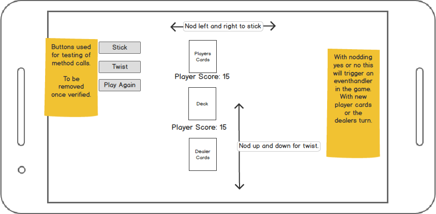

# Gesture-Based-UI-Project
This project is a 4th year assignment for the module Gesture Based UI Development.
## Link to youtube demo [HERE](https://www.youtube.com/watch?v=Uiy2A6vALLQ)
## Overview
For this module we were given an open ended project that integrates gesture based user interatcion with an application.
Uisng voice commands hand or head gestures to control an object via a software framework.
The choice of programming language and hardware was up to us to choose along with the type to gesture control to imnplement.

I have chosen to develop a blackjack game in VR using head guestures, unity, google cardboard and my android phone.
The player controls the game via head movements nodding yes or no to choose between the options available to the user.
The two options are Stick (nod no) or twist (nod yes).

Once the game has been completed (win or loose) a message is displayed to the user along with an option to play again.

The option to play again is in the form of a button in the users view that can be activated via gaze input.
When the user points the reticle at the button for more than 1 second it will create a click event to restart the game.

However before I came to decide on developing this system there were other ideas that were considered.

### Initial ideas.

The first idea I had was to develop a 3D game that controls a game object via a mobile phone accellerometer. 

This user would controll the object via hand gestures of:
Tilt Left: move left.
Tilt Right: move right.
Tilt Up: Move forward.
Tilt down: Move backwards.

The players game object would have to collect certain shapes to gain a positive score.
There woulsd also be certain shapes that would have a negative impact on the players score.

The objects that the player would collect and avoid would be dropped into the playing area for interaction.
In researching this proposal i had my phone dispalying the accellorometer and gyroscope data along with moving a basic game objest in a 3d environment.

However there was a issue with the data being processed by my phone specific to my model and an alternative proposal was needed for this project.
Here is an article on unity forums explaining the problem [Link Here](https://answers.unity.com/questions/1273323/gyroscope-samsung-s7-doesnt-work-properly.html).

### New Plan
After researching what my model of phone was capable of for gesture bsed development I foud Google Cardboard was a possibility.
I had a talk with my lecturer and we discussed VR and head gestures controlling a card game.
From this conversation I had the idea of creating a blackjack game that would be controlled by head guestures.

In the sections below I will discuss how I went about developing the game along with implementing the head gesture recognition for the system.

### Purpose of the application
The purpose of this application is to allow a user to control a card game while using only head gestures.

The card game will be presented to the user via an app on their mobile phone.
This app is a virtual reallity environment using Google VR.
With the phone attached to a Google cardboard or similar device the users head positon can be tracked.
Tracking the users head is achieved by getting the angle of tilt relative to the phone position (More about this below).
With this data we can then capture head gestures and map them to actions within the game.

### Gestures identified as appropriate for this application
The gestures chosen for this application are yes and no head movements.

Yes moving head up and down and No by moving head left and right.

These head movements will map to the actions of stick or twist within the game environment.

The head gesture of yes triggering the twist function and giving the player a new card.

The head gesture of no triggering the stick function and activating the dealers turn function.

When the game of black jack has finished the user is presented with a message if they have won or not and the option to play again or exit the application. 

The yes head gesture will play again and the no getsure will exit the application.

### Hardware used in creating the application
The application is compiled and built to an andriod device with unity.

A VR headset is used to view the game when the application is run on the device.

### Development

When first developing the blackjack portion of the application buttons were used for click events of stick, twist and play again.

These buttons triggering the stick, twist and play again will eventually be removed once the game functions have been verified as working.

These functions will then be mapped to yes and no head gestures.
### Black Jack game development

#### Sprites:

#### Prefabs

### Game controlller

#### Shuffling the deck

#### Adding Values to the cards

#### Handling the ace card value

#### Players turn

#### Twist:

#### Stick:

#### Dealers turn

#### Game over conditions

#### Play again

### Yes no head gesture development

#### Camera angle 

#### Boolean triggers

#### Yes head gesture:

#### No head gesture:

####  Bringing the two elements together

### Architecture for the solution

### Conclusions & Recommendations

### Problems while developing

### Further development 

### Resources

Author: Kevin Gleeson
